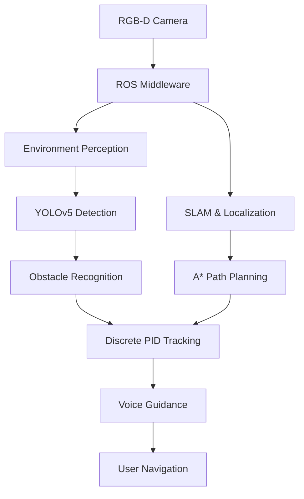

# Assistive Navigation System for Visually Impaired Pedestrians

> An assistive robotic navigation system that integrates **ROS1, RGB-D perception, YOLOv5, SLAM, path planning** to support safe navigation for visually impaired pedestrians.


## Project Highlights

| ROS1 Gazebo Simulation | A* Path Planning & Trajectory Tracking | YOLOv5-Based Tactile Paving Detection |
|:-----------------------:|:--------------------------------------:|:-------------------------------------:|
|  |  |  |

The project integrates **ROS1 Gazebo simulation**, **A*-based path planning with discrete PID trajectory tracking**, and **YOLOv5-based tactile paving detection** into a unified assistive navigation framework for visually impaired pedestrians.

## Project Overview

The objective of this project is to develop an assistive navigation system capable of providing safe and intuitive guidance for visually impaired pedestrians.

The system combines environmental perception, localization, navigation planning, and human-centered voice guidance into a unified robotic framework.


## System Architecture

```text
RGB-D Camera
      │
      ▼
ROS Middleware
      │
      ├── Environment Perception
      │      ├── YOLOv5 Detection
      │      ├── Obstacle Recognition
      │      └── Free Space Estimation
      │
      ├── Localization
      │      ├── SLAM
      │      ├── Occupancy Grid
      │      └── Pose Estimation
      │
      ├── Navigation
      │      ├── Global Path Planning
      │      ├── Local Path Tracking
      │      └── Discrete PID Control
      │
      └── Human Interface
             ├── Voice Guidance
             ├── Hazard Notification
             └── Navigation Assistance
```


## Methodology

### Environment Perception

The RGB-D camera provides depth and color information for obstacle recognition and free-space estimation.

Main components include:

- RGB-D perception
- Free-space estimation
- Obstacle recognition
- Environment understanding


### Object Detection

YOLOv5 is employed to detect tactile paving blocks and surrounding obstacles in real time.

The detected information assists pedestrian navigation in sidewalk environments.


### Localization

SLAM is used to estimate the robot pose while simultaneously constructing an occupancy grid map.

This enables robust localization during autonomous navigation.


### Navigation

The navigation module generates a global path using the A* algorithm.

A discrete PID controller tracks the generated path while compensating for trajectory deviations during navigation.


### Human Assistance

The planned navigation route is translated into voice instructions to assist visually impaired users.

Voice feedback includes:

- Direction guidance
- Hazard warnings
- Destination assistance


## Software Stack

| Category | Technologies |
|----------|--------------|
| Middleware | ROS1 |
| Programming | Python, C++ |
| Perception | OpenCV, YOLOv5 |
| Localization | SLAM |
| Navigation | A*, Discrete PID |
| Visualization | RViz, Gazebo |
| Sensors | RGB-D Camera |


## Key Contributions

- Developed an integrated assistive navigation framework.
- Implemented RGB-D perception and obstacle recognition.
- Developed tactile paving detection using YOLOv5.
- Implemented global path planning with A*.
- Designed a discrete PID controller for trajectory tracking.
- Integrated voice guidance for user navigation.


## Future Work


