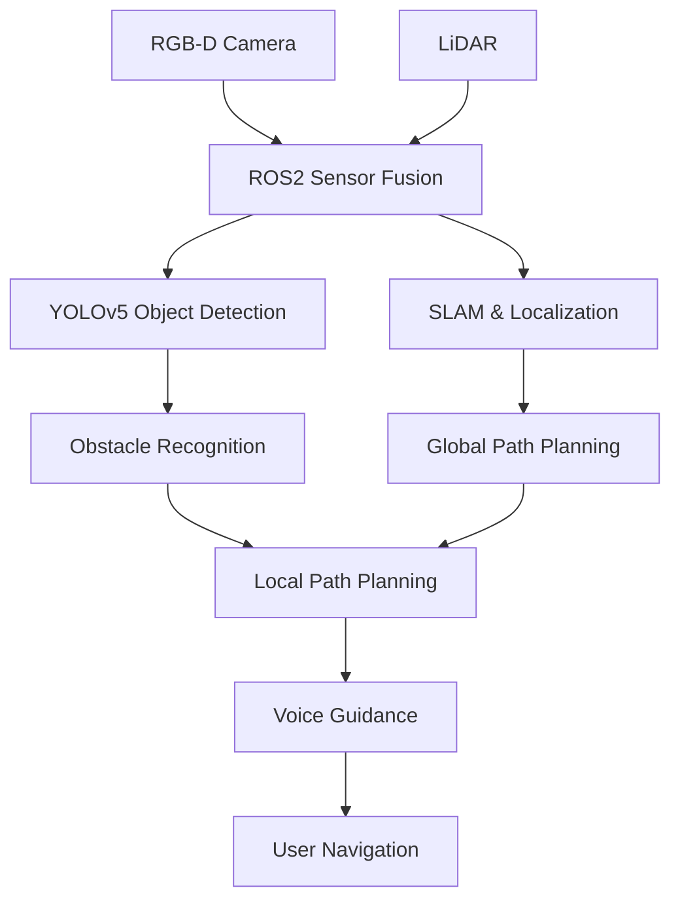

# 🦮 Capstone 1 – AI-based Assistive Navigation System

> Development of an AI-powered assistive navigation system for visually impaired pedestrians using **ROS2, LiDAR, Depth Camera, YOLOv5, SLAM, Path Planning, and Voice Guidance**.

---

## 📖 Overview

The project aims to provide safe and intuitive navigation assistance for visually impaired users in both indoor and outdoor environments.

The system integrates environmental perception, localization, obstacle detection, path planning, and voice guidance into a single assistive robotic platform.

---

# 📷 Project Overview



---

## 🚀 System Architecture

```text
Sensors
├── RGB-D Camera
├── 2D LiDAR
└── IMU

        │
        ▼

ROS2 Middleware

        │
        ▼

Perception
├── YOLOv5
├── Obstacle Detection
├── Free Space Detection
└── Semantic Understanding

        │
        ▼

Localization
├── SLAM
├── Map Generation
└── Pose Estimation

        │
        ▼

Planning
├── Global Planner
├── Local Planner
└── Collision Avoidance

        │
        ▼

Human Interface
├── Voice Guidance
├── Audio Warning
└── Navigation Feedback
```

---

## ⚙️ Main Components

### Environment Perception

- RGB-D camera-based obstacle detection
- LiDAR-based environmental mapping
- Sensor fusion
- Free-space estimation

---

### Object Recognition

- YOLOv5 object detection
- Dynamic obstacle recognition
- Pedestrian detection
- Traffic sign recognition

---

### Localization & Mapping

- ROS2 SLAM
- Real-time localization
- Occupancy grid map generation
- Pose estimation

---

### Navigation

- Global path planning
- Local obstacle avoidance
- Safe waypoint generation
- Real-time path update

---

### User Assistance

- Voice navigation
- Direction guidance
- Hazard warning
- Destination assistance

---

## 🛠️ Tech Stack

- ROS2
- Python
- C++
- OpenCV
- YOLOv5
- LiDAR
- RGB-D Camera
- SLAM
- RViz
- Ubuntu

---

## 🎯 Key Contributions

- Developed an integrated assistive navigation framework.
- Implemented sensor fusion between LiDAR and RGB-D camera.
- Built real-time obstacle recognition using YOLOv5.
- Designed safe path planning for pedestrian navigation.
- Integrated voice guidance for intuitive human interaction.
